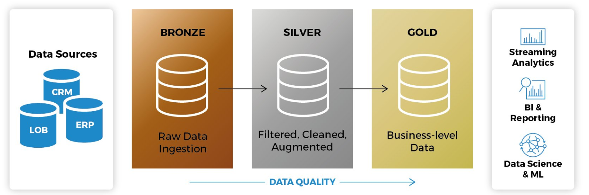
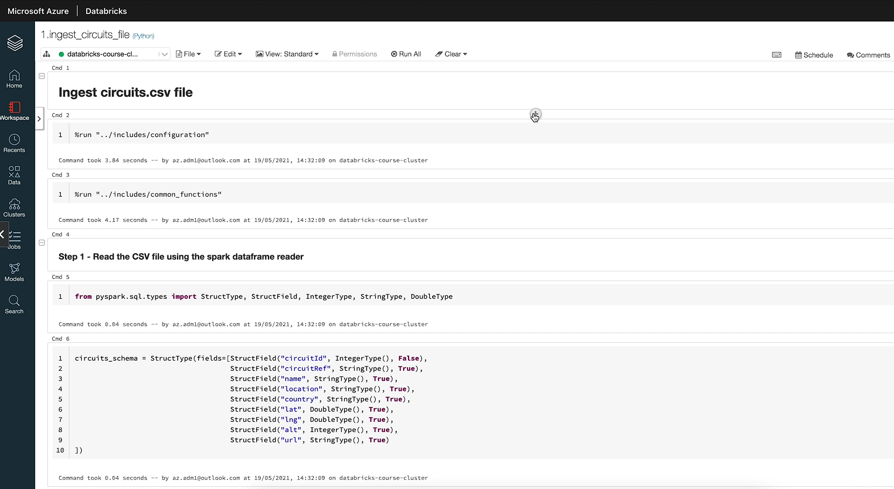

# End to End Formula1 Data Engineering project with Azure Databricks 

## Project Overview

This project presents the creation of a seamless data pipeline on Azure, orchestrated with PySpark, Azure Data Lake Storage (ADLS), Azure Databricks, and Azure Data Factory. The pipeline guides data through its transformation from the raw bronze stage to the refined gold layer, utilizing incremental loading and establishing external tables for in-depth analytics. At its core, Delta Lake, an open-source storage layer, guarantees ACID transactions and efficient metadata management.

## Project pipeline

## Medallion Architecture

This project follows the **Medallion Architecture**:
The Medallion Architecture is a data management framework that organizes data into three distinct layers—bronze, silver, and gold—each serving a specific purpose in the data processing pipeline.

1.Bronze Layer: This is the raw data layer where data is ingested in its original form, often from various sources. It's unprocessed and used for historical reference.

2.Silver Layer: In this layer, the data is cleaned, transformed, and enriched. It's structured and ready for further processing or analytics.

3.Gold Layer: The final layer where data is highly refined, aggregated, and optimized for reporting and advanced analytics. This layer often feeds dashboards, machine learning models, and other business intelligence tools.

The Medallion Architecture ensures a clear, scalable, and organized flow of data from ingestion to high-value insights.

## **Azure Services Used**

### **Azure Databricks**
- Employed Databricks notebooks for interactive data exploration and analysis, akin to Jupyter-style notebooks.
- Harnessed Databricks clusters for scalable, high-performance big data processing and computation.
- Designed and managed jobs within Databricks to automate workflows, ensure smooth data processing, and test end-to-end solutions.

### **Azure Key Vault**
- Managed and secured sensitive data by storing secrets, keys, and certificates in Azure Key Vault.
- Implemented access policies and encryption controls to protect data and ensure compliance.
- Integrated Azure Key Vault with applications to provide secure and seamless access to secrets and cryptographic keys.

### **Azure Active Directory**
- Configured Azure Active Directory to create and manage service principals, facilitating secure and controlled access to Azure resources.
- Assigned appropriate roles and permissions to service principals via Azure AD, ensuring proper authorization for application and automation tasks.
- Leveraged service principals in Azure AD to enable secure, automated interactions between applications and Azure services.

### **Azure Delta Lake**
- Enabled reliable and performant data operations with Delta Lake’s support for ACID transactions, schema enforcement, and data versioning.
- Enabled scalable data lake management with Delta Lake’s support for concurrent reads and writes, reducing data processing bottlenecks.

### **Azure Data Lake Storage Gen 2**
- Initially Integrated Azure Data Lake Storage Gen 2 with Azure Databricks( raw, processed, presentation containers ) for scalable and secure data storage and access.
- Leveraged ADLS Gen 2's hierarchical namespace within Databricks to optimize data organization and management.
- Utilized Azure Databricks' capabilities to perform efficient data processing and analytics directly on data stored in ADLS Gen 2.

### **Azure Data Factory**
- Designed and deployed data pipelines in Azure Data Factory to automate data movement and transformation across different storage layers.
- Configured and managed triggers in Data Factory to schedule and orchestrate ETL (Extract, Transform, Load) processes efficiently.
- Integrated Azure Data Factory with Azure Databricks and Azure Data Lake Storage Gen 2 to streamline data workflows and ensure seamless data connectivity.

### **Azure Unity Catalog**